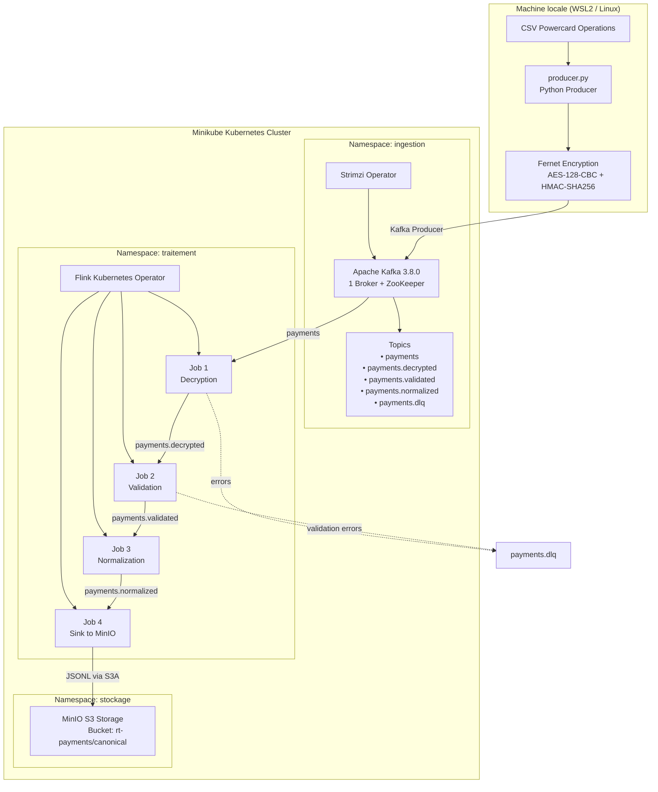

# DGS-Streaming — Traitement Temps Réel des Paiements

> **Proof of Concept** — Pipeline de traitement en temps réel des transactions de paiement,
> déployé sur Minikube pour SWAM

---

## Table des matières

1. [Vue d'ensemble](#1-vue-densemble)
2. [Architecture](#2-architecture)
3. [Prérequis](#3-prérequis)
4. [Structure du projet](#4-structure-du-projet)
5. [Composants déployés](#5-composants-déployés)
6. [Les jobs Flink — Détail complet](#6-les-jobs-flink--détail-complet)
7. [Déploiement](#7-déploiement)
8. [Vérification de l'état du cluster](#8-vérification-de-létat-du-cluster)
9. [Exécution du producteur](#9-exécution-du-producteur)
10. [Sécurité réseau et RBAC](#10-sécurité-réseau-et-rbac)
11. [Dépannage — Problèmes rencontrés](#11-dépannage--problèmes-rencontrés)
12. [Suppression de l'infrastructure](#12-suppression-de-linfrastructure)

---

## 1. Vue d'ensemble

Ce PoC démontre un pipeline de streaming temps réel pour le traitement des transactions de paiement bancaire issues du système **Powercard**. Il lit un fichier CSV d'opérations cartes, chiffre les données avec **Fernet (AES-128-CBC + HMAC-SHA256)**, les publie vers Apache Kafka, puis les fait transiter par 4 jobs PyFlink successifs avant de les stocker dans MinIO (S3-compatible). L'infrastructure complète est provisionnée via **Terraform** sur un cluster Kubernetes local **Minikube**.

```
Fichier CSV Powercard Operations
        │
        ▼
 producer.py (Python)
 ├─ Chiffrement Fernet de chaque ligne
 └─► Topic Kafka: payments
                    │
             job1_decryption.py      → payments.decrypted  (ou payments.dlq)
                    │
             job2_validation.py      → payments.validated   (ou payments.dlq)
                    │
             job3_normalization.py   → payments.normalized
                    │
             job4_sink.py            → MinIO s3a://rt-payments/canonical/
```

**Stack technique :**

| Composant | Technologie | Version |
|-----------|-------------|---------|
| Orchestration K8s | Minikube | ≥ 1.30 |
| Infrastructure as Code | Terraform | ≥ 1.0 |
| Message broker | Apache Kafka (Strimzi) | 3.8.0 |
| Opérateur Kafka | Strimzi | 0.43.0 |
| Moteur de traitement | Apache Flink | 1.18.1 |
| Opérateur Flink | Flink Kubernetes Operator | 1.10.0 |
| Stockage objet | MinIO | Standalone (Helm 5.4.0) |
| Producteur | Python | 3.12 |

---

## 2. Architecture

### Diagramme de flux de données



### Terraform — Deux étapes de déploiement

Le déploiement est divisé en deux étapes pour éviter les conflits de CRDs Kubernetes :

```
terraform/          (Stage 1 — Opérateurs)
├── namespaces.tf   → 3 namespaces (ingestion, traitement, stockage)
├── kafka.tf        → Strimzi operator + attente CRD
├── flink.tf        → Flink Kubernetes Operator + attente CRD
└── minio.tf        → MinIO via Helm

terraform/stage2/   (Stage 2 — Ressources CRD)
├── kafka-crd.tf    → KafkaCluster + 5 KafkaTopics
└── flink-crd.tf    → 4 FlinkDeployments + Secrets Fernet
```

Le Stage 2 ne peut s'exécuter qu'après le Stage 1 car les CRDs doivent exister.
**Les fichiers `.tf` sont générés dynamiquement** par `setup_poc.sh` depuis des heredocs intégrés — ils ne sont pas versionnés. Pour modifier la configuration Terraform, éditer les heredocs dans `setup_poc.sh`.

### Mode application Flink (pas mode session)

Chaque job tourne en **mode application** (`FlinkDeployment` avec une section `job`), ce qui signifie :
- Chaque job dispose de son propre pod JobManager et donc de sa propre interface REST.
- Le jar est référencé en `local://` — ce schéma fonctionne en mode application car le JM lit depuis son propre système de fichiers de conteneur.
- Le jar Python est un **lien symbolique** vers l'original (les deux chemins doivent coexister).

---

## 3. Prérequis

### Outils requis

| Outil | Version minimale |
|-------|-----------------|
| Minikube | ≥ 1.30 |
| kubectl | ≥ 1.28 |
| Helm | ≥ 3.12 |
| Terraform | ≥ 1.0 |
| Docker | ≥ 24.0 (driver Minikube) |
| Python | ≥ 3.10 (pour le producteur) |
| jq, curl | toute version récente |

### Ressources machine

Ce PoC est dimensionné pour une machine avec **16 Go de RAM** :

- Minikube : 7168 Mo de RAM, 4 CPUs
- Budget mémoire pods : ~5,6 Go pour Flink (4 × JM 768m + TM 640m) + ~768 Mo Kafka/ZK + MinIO + opérateurs

---

## 4. Structure du projet

```
POC_Streaming/
├── setup_poc.sh              # Point d'entrée unique — cycle de vie complet
├                
├── README.md                 # Ce document
│
├── flink-jobs/               # Image Docker PyFlink + 4 jobs
│   ├── Dockerfile            # Flink 1.18 + Python + plugin S3 hadoop + Kafka connector
│   ├── requirements.txt      # apache-flink, numpy, pyarrow, cryptography
│   ├── job1_decryption.py
│   ├── job2_validation.py
│   ├── job3_normalization.py
│   ├── job4_sink.py
│   └── common/
│       ├── crypto.py         # Chiffrement/déchiffrement Fernet
│       └── iso_standards.py  # Dictionnaires ISO + Luhn + masquage PAN
│
├── producer/                 # Producteur Kafka local
│   ├── producer.py
│   └── requirements.txt      # kafka-python, pandas, cryptography, lz4
│
├── terraform/                # Stage 1 (généré par setup_poc.sh, git-ignoré)
│   └── stage2/               # Stage 2 (généré par setup_poc.sh, git-ignoré)
│
├── k8s/                      # Manifests Kubernetes (générés, git-ignorés)
│   ├── flink-rbac.yaml
│   └── network-policies.yaml
│
└── data/                     # Fichiers CSV de test (git-ignorés, PAN/PII)
```

---

## 5. Composants déployés

### 5.1 Apache Kafka — namespace `ingestion`

| Ressource | Détail |
|-----------|--------|
| Opérateur | Strimzi 0.43.0 |
| Broker | Kafka 3.8.0, 1 réplique, stockage éphémère |
| ZooKeeper | 1 réplique, stockage éphémère |
| Listeners | `plain:9092` (interne) + `nodeport:9094` (externe) |
| Bootstrap interne | `payments-cluster-kafka-bootstrap.ingestion.svc:9092` |

**Topics du pipeline :**

| Topic | Partitions | Rétention | Usage |
|-------|-----------|-----------|-------|
| `payments` | 1 | 7 jours | Enveloppes chiffrées (entrée producteur) |
| `payments.decrypted` | 1 | 7 jours | Enveloppes déchiffrées (Job 1 → Job 2) |
| `payments.validated` | 1 | 7 jours | Enveloppes validées (Job 2 → Job 3) |
| `payments.normalized` | 1 | 7 jours | Enregistrements canoniques (Job 3 → Job 4) |
| `payments.dlq` | 1 | 30 jours | Dead Letter Queue (rejets Jobs 1 et 2) |

### 5.2 Apache Flink — namespace `traitement`

| Ressource | Détail |
|-----------|--------|
| Opérateur | Flink Kubernetes Operator 1.10.0 |
| Mode | Application (1 JobManager par job) |
| Image Docker | `rt-payments-flink-jobs:1.0` (locale, `imagePullPolicy: Never`) |
| JobManager | 768 Mo RAM, 0.25 CPU |
| TaskManager | 640 Mo RAM, 0.5 CPU |
| Checkpointing | AT_LEAST_ONCE, toutes les 120s, pause min 60s |
| Restart strategy | Exponentielle : 5s → 5min |

**Tuning mémoire JVM (critique pour le PoC) :**

Les valeurs par défaut de l'overhead JVM (256 Mo metaspace + 192 Mo overhead) ne laissent pas assez de mémoire Flink dans de petits conteneurs. Les valeurs ajustées :

```
jvm-metaspace.size = 128mb   (défaut : 256mb)
jvm-overhead.min   = 64mb    (défaut : 192mb)
managed.fraction   = 0.2     (défaut : 0.40 — Python nécessite moins)
```

Résultat : JM 768m → 563m mémoire Flink ✓ | TM 640m → 448m mémoire Flink ✓

### 5.3 MinIO — namespace `stockage`

| Paramètre | Valeur |
|-----------|--------|
| Mode | Standalone |
| Bucket | `rt-payments` |
| Endpoint interne | `http://minio.stockage.svc:9000` |
| Persistence | Désactivée (PoC éphémère) |
| Credentials | `minioadmin` / `minioadmin` |
| Chemin de sortie | `s3a://rt-payments/canonical/` |

---

## 6. Les jobs Flink — Détail complet

### Architecture commune à tous les jobs

Chaque job PyFlink suit le même patron :
- **Source Kafka** : `KafkaSource` avec `SimpleStringSchema` (messages lus comme chaînes JSON)
- **Traitement** : `ProcessFunction` ou `MapFunction` PyFlink
- **Sink Kafka** : `KafkaSink` avec garantie `AT_LEAST_ONCE`
- **Checkpointing** : toutes les 60 secondes
- **Parallélisme** : 1 (configurable via `PARALLELISM` env var)
- **Offsets** : lecture depuis le début (`earliest()`)

---

### Job 1 — Décryption (`job1_decryption.py`)

**Source** : topic `payments`
**Sorties** : topic `payments.decrypted` (succès) | topic `payments.dlq` (échec)

Chaque message reçu est une **enveloppe JSON chiffrée** produite par `producer.py` :

```json
{
  "eventId": "evt-00000001",
  "schemaVersion": "1.0",
  "source": "powercard-csv",
  "encrypted_payload": "gAAAAABk...==",
  "producedAt": 1748700000000
}
```

La `ProcessFunction` `DecryptFn` :
1. Parse le JSON et extrait le champ `encrypted_payload`
2. Déchiffre avec Fernet (clé chargée depuis la variable d'environnement `FERNET_KEY`)
3. Remplace `encrypted_payload` par `payload` (le dict Python des colonnes CSV)
4. Ajoute un horodatage de traitement dans `_processing.decryptedAt`
5. Émet sur le flux principal (`payments.decrypted`)

En cas d'erreur (token invalide, JSON malformé, champ manquant), un message d'erreur structuré est émis via **side output** vers `payments.dlq` :
```json
{
  "stage": "decryption",
  "errorCode": "DECRYPT_FAILED",
  "errorMessage": "InvalidToken: ...",
  "originalMessage": "...",
  "timestamp": 1748700000000
}
```

**Sortie nominale :**
```json
{
  "eventId": "evt-00000001",
  "payload": {
    "MESSAGE_TYPE": "1100",
    "CARD_NUMBER": "4539578763621486",
    "TRANSACTION_AMOUNT": "150.00",
    "TRANSACTION_CURRENCY": "840"
  },
  "_processing": { "decryptedAt": 1748700001234 }
}
```

---

### Job 2 — Validation (`job2_validation.py`)

**Source** : topic `payments.decrypted`
**Sorties** : topic `payments.validated` (valide) | topic `payments.dlq` (invalide)

La fonction `validate(payload)` applique quatre contrôles de conformité ISO :

| Contrôle | Standard | Champ | Règle |
|----------|----------|-------|-------|
| Champs obligatoires | — | `MESSAGE_TYPE`, `CARD_NUMBER`, `TRANSACTION_AMOUNT`, `TRANSACTION_CURRENCY` | Tous doivent être présents et non vides |
| MTI valide | ISO 8583 | `MESSAGE_TYPE` | Doit être l'un des 15 MTI connus (1100–1430) |
| Devise valide | ISO 4217 | `TRANSACTION_CURRENCY` | Code numérique 3 chiffres dans le dictionnaire des devises |
| Algorithme de Luhn | ISO 7812 | `CARD_NUMBER` | Checksum mod-10 doit être valide |

**Si valide**, l'enveloppe est enrichie et émise sur `payments.validated` :
```json
{ "validation": { "valid": true }, "_processing": { "validatedAt": 1748700002000 } }
```

**Si invalide**, une liste structurée d'erreurs est envoyée sur `payments.dlq` :
```json
{
  "validation": {
    "valid": false,
    "errors": [
      { "code": "ISO7812_LUHN_FAILED", "field": "CARD_NUMBER", "valueBin": "453957" },
      { "code": "ISO4217_INVALID_CURRENCY", "field": "TRANSACTION_CURRENCY", "value": "999" }
    ]
  },
  "stage": "validation"
}
```

---

### Job 3 — Normalisation (`job3_normalization.py`)

**Source** : topic `payments.validated`
**Sortie** : topic `payments.normalized`
(pas de DLQ — les données ont déjà été validées)

La `MapFunction` `NormalizeFn` convertit l'enveloppe brute ISO 8583 en un **schéma canonique** inspiré d'ISO 20022 pacs.008 :

| Transformation | Standard | Exemple |
|---------------|----------|---------|
| Normalisation des dates | ISO 8601 | `"16/09/2025 09:49:28"` → `"2025-09-16T09:49:28Z"` |
| Masquage PAN | PCI DSS 3.4 | `"4539578763621486"` → `"453957******1486"` |
| Extraction BIN | ISO 7812 | `"4539578763621486"` → `"453957"` |
| Détection réseau carte | BIN ranges | `"4..."` → `"VISA"` |
| Expansion devise | ISO 4217 | `"840"` → `{ "code": "840", "alpha": "USD", "minorUnits": 2 }` |
| Enrichissement MCC | ISO 18245 | `"5812"` → `"Eating Places, Restaurants"` |
| Expansion MTI | ISO 8583 | `"1100"` → `"Authorization Request"` |

**Schéma canonique de sortie :**
```json
{
  "msgId": "evt-00000001",
  "schema": "rt-payments-canonical-v1",
  "creDtTm": "2025-09-16T09:49:28Z",
  "businessDate": "2025-09-16",
  "iso8583": {
    "mti": "1100",
    "mtiName": "Authorization Request",
    "processingCode": "000000"
  },
  "transaction": {
    "amount": { "value": 150.0, "currencyCode": "840", "currencyAlpha": "USD", "minorUnits": 2 },
    "transactionLocalDate": "2025-09-16T09:49:28Z"
  },
  "card": {
    "panMasked": "453957******1486",
    "panBin": "453957",
    "scheme": "VISA",
    "expiryDate": "2027-12-01T00:00:00Z"
  },
  "merchant": {
    "id": "MERCH001",
    "name": "SUPER CARREFOUR",
    "mcc": "5411",
    "mccDescription": "Grocery Stores, Supermarkets",
    "terminalId": "TERM0042"
  },
  "acquirer": { "institutionCode": "...", "bank": "...", "countryCode": "..." },
  "issuer": { "bank": "...", "networkCode": "..." },
  "audit": { "stan": "123456", "rrn": "000000123456", "authCode": "ABC123" },
  "_processing": { "decryptedAt": ..., "validatedAt": ..., "normalizedAt": 1748700003000 }
}
```

---

### Job 4 — Sink MinIO (`job4_sink.py`)

**Source** : topic `payments.normalized`
**Sortie** : MinIO `s3a://rt-payments/canonical/`

Ce job utilise l'API `FileSink` (Sink2) de Flink pour écrire les enregistrements canoniques en **JSON Lines** (`.jsonl`) vers MinIO.

| Paramètre | Valeur |
|-----------|--------|
| Format | `Encoder.simple_string_encoder("UTF-8")` (JSON Lines) |
| Préfixe des fichiers | `payments` |
| Suffixe | `.jsonl` |
| Rolling — taille max | 64 Mo |
| Rolling — timeout | 60 secondes |
| Rolling — inactivité | 30 secondes |

**Pourquoi le plugin `flink-s3-fs-hadoop` et non `presto` ?**
L'API `FileSink` appelle `createRecoverableWriter()` lors de la construction du graphe de flux. Seul le plugin **hadoop** implémente `RecoverableWriter`. Le plugin **presto** génère une `FlinkRuntimeException: Could not create committable serializer` au démarrage.

---

### Bibliothèque commune (`common/`)

#### `crypto.py`

| Fonction | Description |
|----------|-------------|
| `get_fernet()` | Charge la clé depuis `FERNET_KEY` env var → objet `Fernet` |
| `encrypt_dict(payload)` | `dict` → JSON → chiffrement Fernet → base64 → `str` |
| `decrypt_dict(token)` | `str` (base64) → décodage → déchiffrement → JSON → `dict` |

#### `iso_standards.py`

| Composant | Contenu |
|-----------|---------|
| `ISO8583_MTI` | Dictionnaire des 15 MTI Powercard (1100 → 1430) |
| `ISO4217` | 23 codes de devise (numeric → alpha + minorUnits) |
| `MCC` | 18 Merchant Category Codes (hôtels, restauration, ATM, etc.) |
| `luhn_check(pan)` | Validation mod-10 per ISO/IEC 7812-1 |
| `card_scheme(pan)` | Détection VISA / MASTERCARD / AMEX / UNIONPAY / DISCOVER |
| `mask_pan(pan)` | Masquage PCI DSS (6 premiers + 4 derniers digits) |
| `to_iso8601(value)` | Normalisation date multi-format → `YYYY-MM-DDTHH:MM:SSZ` |
| `business_date_from(value)` | Extraction clé de partition `YYYY-MM-DD` |

---

## 7. Déploiement

### 7.1 Déploiement automatique (recommandé)

```bash
./setup_poc.sh up
```

Ce script exécute dans l'ordre :
1. Vérification des prérequis (minikube, kubectl, helm, terraform, jq, curl)
2. Démarrage de Minikube (7168 Mo, 4 CPUs, driver Docker)
3. Génération des fichiers `.tf` et manifests K8s depuis les heredocs
4. Terraform Stage 1 : namespaces + opérateurs + attente des CRDs
5. Terraform Stage 2 : Kafka cluster + topics + FlinkDeployments + secrets Fernet
6. Application RBAC + NetworkPolicies
7. Build de l'image Docker PyFlink dans le daemon Minikube
8. Attente que les 4 jobs Flink atteignent l'état `STABLE`
9. Affichage du résumé et des commandes de port-forward

### 7.2 Opérations ciblées

```bash
# Rebuild de l'image Docker seulement (après modification d'un job)
./setup_poc.sh build

# Re-déployer uniquement les jobs Flink (après setup_poc.sh build)
./setup_poc.sh jobs

# Voir l'état des pods dans les 3 namespaces
./setup_poc.sh status
```

### 7.3 Accès à l'interface Flink

Chaque job étant en mode application, chacun a sa propre UI :

```bash
kubectl port-forward svc/job1-decryption-rest    8081:8081 -n traitement &
kubectl port-forward svc/job2-validation-rest    8082:8081 -n traitement &
kubectl port-forward svc/job3-normalization-rest 8083:8081 -n traitement &
kubectl port-forward svc/job4-sink-rest          8084:8081 -n traitement &
```

Ouvrir `http://localhost:8081` à `http://localhost:8084`.

---

## 8. Vérification de l'état du cluster

```bash
# État de tous les jobs Flink (vue synthétique)
kubectl get flinkdeployment -n traitement

# Pods par namespace
kubectl get pods -n ingestion
kubectl get pods -n traitement
kubectl get pods -n stockage

# Logs d'un job spécifique
kubectl logs -n traitement <pod-name> -c flink-main-container

# État des topics Kafka
kubectl get kafkatopic -n ingestion

# Vérifier les fichiers produits dans MinIO
kubectl exec -n stockage deployment/minio -- \
  mc ls local/rt-payments/canonical/ --recursive
```

**État nominal attendu :**

```
NAME                  JOB STATUS   LIFECYCLE STATE
job1-decryption       RUNNING      STABLE
job2-validation       RUNNING      STABLE
job3-normalization    RUNNING      STABLE
job4-sink             RUNNING      STABLE
```

---

## 9. Exécution du producteur

### Lancement

```bash
./setup_poc.sh produce "data/<fichier>.csv"
./setup_poc.sh produce "data/<fichier>.csv" 50 200   # rate=50/s, limit=200 lignes
```

Le script crée automatiquement un venv Python (`.producer-venv/`) et installe les dépendances au premier lancement.

### Format des messages publiés

Chaque message Kafka est un objet JSON avec l'enveloppe suivante :

```json
{
  "eventId": "evt-00000042",
  "schemaVersion": "1.0",
  "source": "powercard-csv",
  "encrypted_payload": "gAAAAABk...==",
  "producedAt": 1748700000000
}
```

| Champ | Description |
|-------|-------------|
| `eventId` | Identifiant séquentiel unique (`evt-XXXXXXXX`) |
| `encrypted_payload` | Payload Fernet (AES-128-CBC + HMAC-SHA256), base64-encodé |
| `producedAt` | Timestamp Unix en millisecondes (UTC) |

### Paramètres du producteur

| Argument | Défaut | Description |
|----------|--------|-------------|
| `--csv` | *(requis)* | Chemin vers le fichier CSV Powercard |
| `--bootstrap` | `localhost:9094` | Adresse du broker Kafka |
| `--topic` | `payments` | Topic de destination |
| `--rate` | `20.0` | Messages par seconde |
| `--limit` | `0` (toutes les lignes) | Nombre max de lignes à envoyer |

---

## 10. Sécurité réseau et RBAC

### NetworkPolicies

| Politique | Namespace | Effet |
|-----------|-----------|-------|
| Deny ingress par défaut | `ingestion`, `traitement`, `stockage` | Tout trafic entrant bloqué par défaut |
| `allow-flink-to-kafka` | `ingestion` | Autorise le namespace `traitement` → port 9092 |
| `allow-flink-to-minio` | `stockage` | Autorise le namespace `traitement` → port 9000 |

### RBAC Flink

Le `ServiceAccount` `flink` (namespace `traitement`) est lié au `ClusterRole/edit` via un `ClusterRoleBinding`, permettant aux jobs Flink de créer et gérer leurs propres ressources Kubernetes (pods TaskManager, ConfigMaps).

### Chiffrement Fernet

- La clé Fernet est générée une seule fois dans `.fernet.key` à la racine (git-ignoré)
- Elle est provisionnée comme Kubernetes Secret `fernet-key` dans les namespaces `ingestion` ET `traitement`
- Le producteur la lit via `FERNET_KEY` env var (injectée par `setup_poc.sh`)
- Job 1 la lit depuis le Secret via `FERNET_KEY` env var

---

## 11. Dépannage — Problèmes rencontrés

### ZooKeeper — zxid mismatch après redémarrage

**Symptôme :** Le pod Kafka entre en `CrashLoopBackOff`, Strimzi affiche `ForceableProblem` avec une divergence de zxid.

**Cause :** Le stockage est éphémère. Quand ZK redémarre, il perd son journal de transactions. Si le broker Kafka est toujours en vie avec un zxid supérieur, ZK refuse la connexion.

**Solution :** Supprimer les deux pods simultanément pour les forcer à repartir d'un état vierge :

```bash
kubectl delete pod payments-cluster-zookeeper-0 payments-cluster-kafka-0 -n ingestion
```

---

### Flink — job en `RECONCILING` indéfiniment

**Cause fréquente :** L'image Docker n'a pas été rechargée dans le daemon Minikube après une modification.

**Solution :**

```bash
eval $(minikube docker-env)
docker build -t rt-payments-flink-jobs:1.0 flink-jobs/
kubectl delete flinkdeployment <job-name> -n traitement
./setup_poc.sh jobs
```

---

### Flink — `FlinkRuntimeException: Could not create committable serializer`

**Cause :** Job 4 utilise le plugin S3 `presto` qui n'implémente pas `RecoverableWriter`.

**Solution :** Le `Dockerfile` doit utiliser `flink-s3-fs-hadoop` :

```dockerfile
RUN mkdir -p /opt/flink/plugins/s3-fs-hadoop && \
    cp /opt/flink/opt/flink-s3-fs-hadoop-${FLINK_VERSION}.jar /opt/flink/plugins/s3-fs-hadoop/
```

---

### Flink — `Found 0 flink-python jar`

**Cause :** Le jar Python a été déplacé (`mv`) hors de `/opt/flink/opt/`. `PackagedProgramUtils.getPythonJar()` scanne ce répertoire et requiert exactement un `flink-python*.jar`.

**Solution :** Utiliser un lien symbolique (`ln -sf`), pas `mv` :

```dockerfile
RUN mkdir -p /opt/flink/python-driver && \
    ln -sf /opt/flink/opt/flink-python-${FLINK_VERSION}.jar \
           /opt/flink/python-driver/flink-python.jar
```

---

### Flink — Validation mémoire `64mb < 128mb`

**Cause :** Les valeurs par défaut JVM (metaspace 256 Mo + overhead 192 Mo) laissent moins de 128 Mo de mémoire Flink dans un conteneur de 512 Mo.

**Solution :** Augmenter les conteneurs (JM = 768 Mo, TM = 640 Mo) et réduire les minimums JVM :

```
jobmanager.memory.jvm-metaspace.size = 128mb
jobmanager.memory.jvm-overhead.min   = 64mb
taskmanager.memory.jvm-metaspace.size = 128mb
taskmanager.memory.jvm-overhead.min   = 64mb
```

---

### Terraform — État divergent du cluster

**Symptôme :** `terraform apply` échoue avec `resource already exists`.

**Solution :** Le script `setup_poc.sh` exécute automatiquement `_tf_import_if_missing()` avant chaque apply. En cas de problème persistant :

```bash
./setup_poc.sh down
./setup_poc.sh up
```

---

### Producteur — venv corrompu

```bash
rm -rf .producer-venv
./setup_poc.sh produce "data/<fichier>.csv"
```

---

## 12. Suppression de l'infrastructure

```bash
# Tout supprimer (Terraform destroy + Minikube stop)
./setup_poc.sh down
```

Ce script :
1. Désinstalle les releases Helm (opérateurs)
2. Supprime les ClusterRoleBindings
3. Exécute `terraform destroy` (Stage 2 puis Stage 1)
4. Supprime les namespaces (en forçant la suppression des finalizers)
5. Arrête Minikube

```bash
# Supprimer uniquement le venv producteur
rm -rf .producer-venv
```
