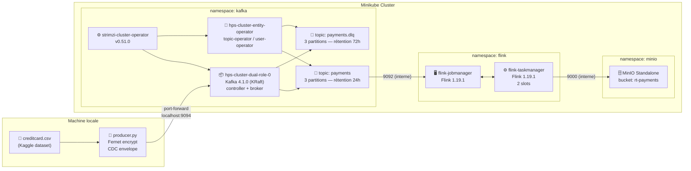
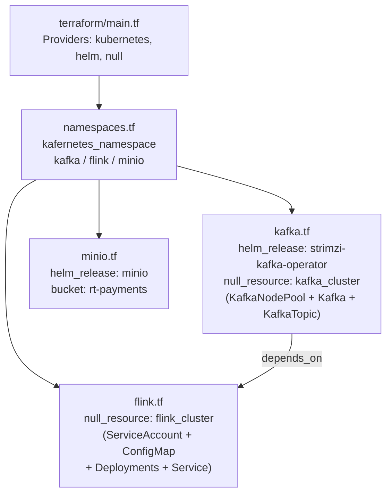
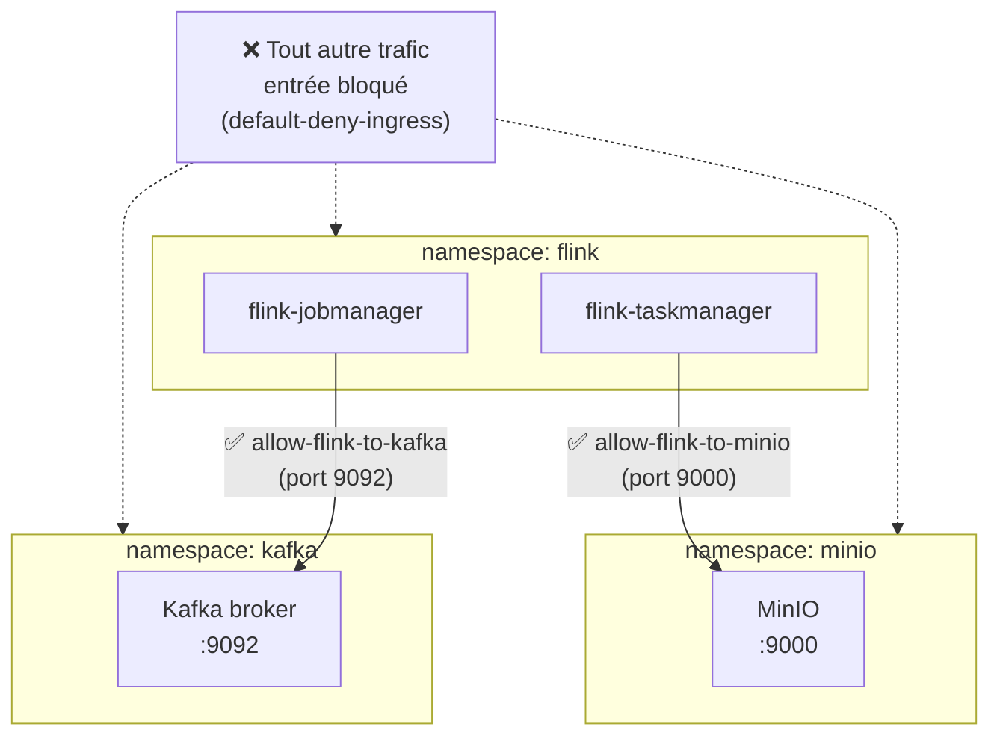

# DGS-Streaming — PoC Traitement Temps Réel des Paiements

> **Proof of Concept** — Pipeline de traitement en temps réel des transactions de paiement,
> déployé sur Minikube pour SWAM

---

## Table des matières

1. [Vue d'ensemble](#1-vue-densemble)
2. [Architecture](#2-architecture)
3. [Prérequis](#3-prérequis)
4. [Structure du projet](#4-structure-du-projet)
5. [Composants déployés](#5-composants-déployés)
6. [Déploiement](#6-déploiement)
7. [Vérification de l'état du cluster](#7-vérification-de-létat-du-cluster)
8. [Exécution du producteur](#8-exécution-du-producteur)
9. [Sécurité réseau et RBAC](#9-sécurité-réseau-et-rbac)
10. [Dépannage — Problèmes rencontrés](#10-dépannage--problèmes-rencontrés)
11. [Data Mart PostgreSQL — Schéma en étoile](#11-data-mart-postgresql--schéma-en-étoile)
12. [Pipeline Gold → Data Mart (gold-sink)](#12-pipeline-gold--data-mart-gold-sink)
13. [Monitoring Business — Exporteur & Dashboards Grafana](#13-monitoring-business--exporteur--dashboards-grafana)
14. [Suppression de l'infrastructure](#14-suppression-de-linfrastructure)

---

## 1. Vue d'ensemble

Ce PoC démontre un pipeline de streaming temps réel pour le traitement des transactions de paiement bancaire. Il simule un flux de données de type **Change Data Capture (CDC)** à partir d'un fichier CSV Kaggle (jeu de données de transactions de cartes de crédit), chiffre les données avec **Fernet (AES-128-CBC + HMAC-SHA256)**, et les publie vers Apache Kafka. L'infrastructure complète est provisionnée via **Terraform** sur un cluster Kubernetes local **Minikube**.

```
Données CSV Kaggle
      │
      ▼
Producer Python ──► Apache Kafka ──► Apache Flink ──► MinIO (S3)
(Fernet encrypt)    (Strimzi KRaft)  (Session Cluster) (rt-payments)
```

**Stack technique :**

| Composant | Technologie | Version |
|-----------|-------------|---------|
| Orchestration K8s | Minikube | ≥ 1.30 |
| Infrastructure as Code | Terraform | ≥ 1.0 |
| Message broker | Apache Kafka (Strimzi) | 4.1.0 |
| Opérateur Kafka | Strimzi | 0.51.0 |
| Moteur de traitement | Apache Flink | 1.19.1 |
| Stockage objet | MinIO | Standalone |
| Producteur | Python | 3.12 |

---

## 2. Architecture

### Diagramme de flux de données



### Diagramme d'infrastructure Terraform



### Diagramme de sécurité réseau



---

## 3. Prérequis

### Outils requis

| Outil | Version minimale | Installation |
|-------|-----------------|--------------|
| Minikube | ≥ 1.30 | [minikube.sigs.k8s.io](https://minikube.sigs.k8s.io) |
| Helm | ≥ 3.12 | `snap install helm --classic` |
| Terraform | ≥ 1.0 | `snap install terraform` |
| Python | ≥ 3.10 | Système |
| Docker | ≥ 24.0 | Requis comme driver Minikube |

### ⚠️ Note importante sur kubectl

Sur cette machine, **`kubectl` provoque une erreur de segmentation (segfault)**. Il faut **toujours** utiliser l'alias fourni par Minikube :

```bash
# ✅ Commande correcte sur cette machine
minikube kubectl -- get pods -n kafka

# ❌ Ne pas utiliser — provoque un segfault
kubectl get pods -n kafka
```

### Démarrage de Minikube

```bash
minikube start --cpus=2 --memory=3072 --driver=docker
```

> **Contraintes de ressources** : Le cluster est dimensionné pour 2 vCPU et 3 072 Mo de RAM.
> Ces limites ont dicté les choix de configuration mémoire de Flink (voir section [Dépannage](#10-dépannage--problèmes-rencontrés)).

---

## 4. Structure du projet

```
hps-rt-poc/
├── .gitignore                    # Exclut .claude/, .terraform/, tfstate, __pycache__
├── README.md                     # Ce document
├── pyrightconfig.json            # Configuration Pylance/Pyright
├── k8s/
│   ├── flink-rbac.yaml           # ClusterRoleBinding: flink → ClusterRole/edit
│   └── network-policies.yaml    # NetworkPolicies inter-namespaces
├── scripts/
│   ├── producer.py               # Producteur Kafka (Fernet + CDC envelope)
│   └── deploy_infrastructure.sh # Script de déploiement complet end-to-end
└── terraform/
    ├── main.tf                   # Configuration des providers (kubernetes, helm, null)
    ├── namespaces.tf             # Création des namespaces K8s
    ├── variables.tf              # Variables avec valeurs par défaut
    ├── outputs.tf                # Endpoints de sortie (bootstrap, minio, flink REST)
    ├── kafka.tf                  # Strimzi operator + KafkaNodePool + Kafka + KafkaTopic
    ├── minio.tf                  # Helm release MinIO
    ├── flink.tf                  # Session cluster Flink (JM + TM + ConfigMap)
    └── postgres.tf               # Schéma Data Mart (ConfigMaps + apply idempotent via psql)
```

### 4.1 Fichiers ajoutés — Data Mart & Monitoring Business

En complément de l'arborescence ci-dessus, les fichiers suivants implémentent le
data mart PostgreSQL, le pont Kafka → PostgreSQL et le monitoring métier
(voir sections [11](#11-data-mart-postgresql--schéma-en-étoile),
[12](#12-pipeline-gold--data-mart-gold-sink) et
[13](#13-monitoring-business--exporteur--dashboards-grafana)) :

```
hps-rt-poc/
├── sql/
│   ├── datamart_schema.sql           # Schéma en étoile : fact_transactions + dims + trigger
│   ├── source_transactions_schema.sql # Table source CDC (postgres-hps/hps_db)
│   └── analytics.sql                  # 6 requêtes d'analyse métier
├── scripts/
│   ├── hps_exporter.py               # Exporteur Prometheus métriques métier (:8888/metrics)
│   ├── create_dashboards.py          # Dashboards Grafana existants (helpers réutilisés)
│   └── create_business_dashboards.py # 2 nouveaux dashboards (Business Analytics, Data Quality)
└── terraform/
    └── postgres.tf                   # Application idempotente du schéma star schema
```

---

## 5. Composants déployés

### 5.1 Apache Kafka — namespace `kafka`

| Ressource | Nom | Détail |
|-----------|-----|--------|
| Helm release | `strimzi-kafka-operator` | Opérateur Strimzi v0.51.0 |
| Pod opérateur | `strimzi-cluster-operator-*` | Surveille le namespace `kafka` |
| KafkaNodePool | `dual-role` | 1 réplique, rôles : controller + broker |
| Pod broker | `hps-cluster-dual-role-0` | Image `quay.io/strimzi/kafka:0.51.0-kafka-4.1.0` |
| Entity Operator | `hps-cluster-entity-operator` | Topic Operator + User Operator |

**Configuration du cluster Kafka (`hps-cluster`) :**
- Mode : **KRaft** (sans Zookeeper) — activé via `strimzi.io/kraft: enabled`
- Version : **4.1.0**, metadataVersion : **4.1-IV1**
- Listener : `plain` sur le port **9092** (interne, sans TLS)
- Stockage : **éphémère** (PoC, pas de persistence)
- Bootstrap interne : `hps-cluster-kafka-bootstrap.kafka.svc.cluster.local:9092`

**Topics :**

| Nom | Partitions | Réplication | Rétention | Usage |
|-----|-----------|-------------|-----------|-------|
| `payments` | 3 | 1 | 24h (86 400 000 ms) | Transactions chiffrées |
| `payments.dlq` | 3 | 1 | 72h (259 200 000 ms) | Dead Letter Queue |

### 5.2 Apache Flink — namespace `flink`

| Ressource | Nom | Détail |
|-----------|-----|--------|
| ServiceAccount | `flink` | Identité K8s des pods Flink |
| ConfigMap | `flink-config` | Configuration hiérarchique YAML (Flink 1.19) |
| Deployment | `flink-jobmanager` | 1 réplique, REST UI sur :8081 |
| Deployment | `flink-taskmanager` | 1 réplique, 2 slots de tâches |
| Service | `flink-jobmanager` | ClusterIP, ports : 6123 (RPC), 6124 (blob), 8081 (REST) |

**Configuration mémoire Flink (adaptée aux contraintes Minikube) :**

```yaml
jobmanager:
  memory:
    process.size: 512m
    jvm-metaspace.size: 96m      # réduit depuis 256m par défaut
    jvm-overhead.min: 32m        # réduit depuis 192m par défaut
    jvm-overhead.max: 128m
    jvm-overhead.fraction: 0.1

taskmanager:
  memory:
    process.size: 512m
    jvm-metaspace.size: 96m
    jvm-overhead.min: 32m
    framework.heap.size: 64m     # réduit depuis 128m par défaut
    framework.off-heap.size: 64m # réduit depuis 128m par défaut
  numberOfTaskSlots: 2
```

**Endpoint REST (accès local) :**
```bash
minikube kubectl -- port-forward svc/flink-jobmanager 8081:8081 -n flink
# Ouvrir : http://localhost:8081
```

### 5.3 MinIO — namespace `minio`

| Paramètre | Valeur |
|-----------|--------|
| Mode | Standalone |
| Bucket | `rt-payments` |
| Persistence | Désactivée (PoC) |
| Endpoint interne | `http://minio.minio.svc.cluster.local:9000` |
| Credentials | `admin` / `admin123` |

**Accès à la console MinIO :**
```bash
minikube kubectl -- port-forward svc/minio 9001:9001 -n minio
# Ouvrir : http://localhost:9001
```

---

## 6. Déploiement

### 6.1 Déploiement automatique (recommandé)

```bash
cd ~/hps-rt-poc
bash scripts/deploy_infrastructure.sh
```

Ce script :
1. Vérifie les prérequis (minikube en cours d'exécution, helm, terraform)
2. Ajoute les dépôts Helm : `strimzi` et `minio`
3. Exécute `terraform init -upgrade` puis `terraform apply -auto-approve`
4. Applique les manifestes K8s : RBAC et NetworkPolicies
5. Attend que tous les pods soient `Ready`
6. Affiche l'état final et les outputs Terraform

### 6.2 Déploiement manuel étape par étape

```bash
# 1. Démarrer Minikube
minikube start --cpus=2 --memory=3072 --driver=docker

# 2. Ajouter les dépôts Helm
helm repo add strimzi https://strimzi.io/charts/
helm repo add minio   https://charts.min.io/
helm repo update

# 3. Déployer l'infrastructure avec Terraform
cd ~/hps-rt-poc/terraform
terraform init -upgrade
terraform apply -auto-approve

# 4. Appliquer les manifestes K8s
minikube kubectl -- apply -f ~/hps-rt-poc/k8s/flink-rbac.yaml
minikube kubectl -- apply -f ~/hps-rt-poc/k8s/network-policies.yaml
```

### 6.3 Outputs Terraform

Après un `terraform apply` réussi :

```bash
cd ~/hps-rt-poc/terraform && terraform output
```

```
flink_namespace      = "flink"
flink_rest_endpoint  = "http://flink-jobmanager.flink.svc.cluster.local:8081"
kafka_bootstrap      = "hps-cluster-kafka-bootstrap.kafka.svc.cluster.local:9092"
kafka_namespace      = "kafka"
minio_bucket         = "rt-payments"
minio_endpoint       = "http://minio.minio.svc.cluster.local:9000"
minio_namespace      = "minio"
```

---

## 7. Vérification de l'état du cluster

```bash
# État des pods par namespace
minikube kubectl -- get pods -n kafka
minikube kubectl -- get pods -n flink
minikube kubectl -- get pods -n minio

# État des topics Kafka
minikube kubectl -- get kafkatopic -n kafka

# Tous les namespaces
minikube kubectl -- get namespaces

# NetworkPolicies actives
minikube kubectl -- get networkpolicy -n kafka
minikube kubectl -- get networkpolicy -n flink
minikube kubectl -- get networkpolicy -n minio

# RBAC Flink
minikube kubectl -- get clusterrolebinding flink-role-binding
```

**État attendu nominal :**

```
namespace: kafka
NAME                                           READY   STATUS    RESTARTS
hps-cluster-dual-role-0                        1/1     Running   ...
hps-cluster-entity-operator-*                  2/2     Running   ...
strimzi-cluster-operator-*                     1/1     Running   ...

namespace: flink
NAME                                 READY   STATUS    RESTARTS
flink-jobmanager-*                   1/1     Running   ...
flink-taskmanager-*                  1/1     Running   ...

namespace: minio
NAME                     READY   STATUS    RESTARTS
minio-*                  1/1     Running   ...

kafkatopics (namespace: kafka)
NAME           CLUSTER       PARTITIONS   REPLICATION FACTOR   READY
payments       hps-cluster   3            1                    True
payments.dlq   hps-cluster   3            1                    True
```

---

## 8. Exécution du producteur

### 8.1 Installation des dépendances

```bash
pip install kafka-python cryptography pandas
```

### 8.2 Port-forward Kafka (accès depuis la machine locale)

```bash
# Expose le broker Kafka sur le port local 9094
minikube kubectl -- port-forward svc/hps-cluster-kafka-bootstrap 9094:9092 -n kafka &
```

### 8.3 Lancement du producteur

```bash
python scripts/producer.py \
  --csv /chemin/vers/creditcard.csv \
  --bootstrap localhost:9094 \
  --topic payments \
  --rate 20 \
  --limit 5000
```

**Paramètres :**

| Argument | Valeur par défaut | Description |
|----------|------------------|-------------|
| `--csv` | *(requis)* | Chemin vers le fichier CSV Kaggle |
| `--bootstrap` | `localhost:9094` | Adresse du broker Kafka |
| `--topic` | `payments` | Topic de destination |
| `--rate` | `10.0` | Messages par seconde (doit être > 0) |
| `--limit` | `0` (toutes les lignes) | Nombre maximum de lignes à envoyer |

### 8.4 Format des messages publiés

Chaque message Kafka est un objet JSON structuré en **enveloppe CDC** :

```json
{
  "eventId":   "550e8400-e29b-41d4-a716-446655440000",
  "table":     "creditcard_transactions",
  "operation": "INSERT",
  "payload":   "gAAAAABk...==",
  "timestamp": "2026-04-20T14:30:00.123456+00:00"
}
```

- **`eventId`** : UUID v4 unique par message
- **`table`** : Nom de la table source (CDC)
- **`operation`** : Type d'opération (`INSERT`)
- **`payload`** : Ligne CSV chiffrée avec **Fernet** (AES-128-CBC + HMAC-SHA256)
- **`timestamp`** : Horodatage UTC ISO 8601

> **Important** : La clé Fernet est générée à chaque démarrage et affichée en console.
> Il faut la sauvegarder pour pouvoir déchiffrer les données ultérieurement.
> ```
> [producer] Fernet key (save to decrypt): b'abcDEF123...='
> ```

---

## 9. Sécurité réseau et RBAC

### 9.1 NetworkPolicies

Les NetworkPolicies appliquées suivent le principe du **moindre privilège** :

| Politique | Namespace | Effet |
|-----------|-----------|-------|
| `default-deny-ingress` | `kafka`, `flink`, `minio` | Bloque tout trafic entrant par défaut |
| `allow-flink-to-kafka` | `kafka` | Autorise le namespace `flink` → port 9092 |
| `allow-kafka-internal` | `kafka` | Autorise le trafic intra-namespace (opérateur ↔ broker) |
| `allow-flink-to-minio` | `minio` | Autorise le namespace `flink` → port 9000 |

### 9.2 RBAC Flink

Le ServiceAccount `flink` (namespace `flink`) est lié au ClusterRole `edit` via
le `ClusterRoleBinding` nommé `flink-role-binding`. Cela permet aux jobs Flink
d'interagir avec l'API Kubernetes (découverte de jobs, checkpoints, HA).

---

## 10. Dépannage — Problèmes rencontrés

### 10.1 `kubectl` provoque un segfault

**Symptôme :**
```
Segmentation fault (core dumped)
```

**Cause :** Incompatibilité entre la version de `kubectl` système (v1.29) et le serveur Kubernetes Minikube (v1.35).

**Solution :** Utiliser exclusivement l'alias Minikube :
```bash
# Remplacer toute occurrence de "kubectl" par :
minikube kubectl --
```

---

### 10.2 Conflit de rolebindings Strimzi

**Symptôme :**
```
Error: INSTALLATION FAILED: rendered manifests contain a resource
that already exists. Resource: ClusterRoleBinding ...
```

**Cause :** Une ancienne installation de Strimzi laisse des `ClusterRoleBinding` qui entrent en conflit avec la nouvelle.

**Solution :**
```bash
# Supprimer les ClusterRoleBindings orphelins avant de réappliquer
minikube kubectl -- delete clusterrolebinding \
  strimzi-cluster-operator strimzi-cluster-operator-kafka-broker-delegation \
  --ignore-not-found

# Puis relancer
terraform apply -auto-approve
```

---

### 10.3 CRD `kafkatopics.kafka.strimzi.io` non installé

**Symptôme :**
```
error: the server doesn't have a resource type "kafkatopic"
```

**Cause :** Helm n'installe pas automatiquement les CRDs lors d'un `helm upgrade`. La CRD `kafkatopics` peut être absente après une réinstallation.

**Solution :**
```bash
# Extraire et appliquer toutes les CRDs Strimzi depuis le chart
helm show crds strimzi/strimzi-kafka-operator --version 0.51.0 \
  > /tmp/strimzi-crds.yaml
minikube kubectl -- apply -f /tmp/strimzi-crds.yaml
```

---

### 10.4 Namespace `kafka` bloqué en état `Terminating`

**Symptôme :**
```
minikube kubectl -- get namespace kafka
NAME    STATUS        AGE
kafka   Terminating   10m
```

**Cause :** Des finalizers Strimzi sur les ressources `KafkaTopic` empêchent la suppression du namespace après la désinstallation de l'opérateur.

**Solution :**
```bash
# Forcer la suppression des finalizers du namespace
minikube kubectl -- replace --raw \
  "/api/v1/namespaces/kafka/finalize" \
  -f - <<EOF
{
  "apiVersion": "v1",
  "kind": "Namespace",
  "metadata": {"name": "kafka"},
  "spec": {"finalizers": []}
}
EOF
```

---

### 10.5 Flink crash — `Total Flink Memory < Off-heap Memory`

**Symptôme :**
```
IllegalConfigurationException: Total Flink Memory (64MB) < Off-heap Memory (128MB)
```

**Cause :** Avec `jobmanager.memory.process.size: 512m`, les valeurs par défaut de Flink 1.19 consomment toute la mémoire en overhead JVM :
- JVM Overhead minimum par défaut : **192m**
- JVM Metaspace par défaut : **256m**
- Total overhead : 448m → il ne reste que **64m** pour Flink, insuffisant.

**Solution appliquée dans `flink.tf` :**
```yaml
jobmanager:
  memory:
    process.size: 512m
    jvm-metaspace.size: 96m      # était 256m
    jvm-overhead.min: 32m        # était 192m
    jvm-overhead.max: 128m
    jvm-overhead.fraction: 0.1
```

Calcul résultant :
- JVM overhead effectif : `0.1 × 512 = 51.2m` → dans `[32m, 128m]` ✓
- JVM metaspace : `96m`
- **Mémoire Flink disponible : `512 - 51.2 - 96 = 364.8m`** > 128m minimum ✓

---

### 10.6 Flink crash — ConfigMap monté en lecture seule

**Symptôme :**
```
/opt/flink/bin/config-parser-utils.sh: line 45:
/opt/flink/conf/config.yaml: Read-only file system
```

**Cause :** Flink 1.19 utilise `/opt/flink/conf/config.yaml` (format YAML hiérarchique, non l'ancien `flink-conf.yaml`). Le script de démarrage `config-parser-utils.sh` tente d'**écrire** dans ce fichier au démarrage. Un montage `subPath` depuis un ConfigMap est en lecture seule, ce qui provoque l'échec.

**Solution appliquée — `initContainer` + `emptyDir` :**

```yaml
volumes:
  - name: flink-config-volume
    configMap:
      name: flink-config
  - name: flink-conf-dir
    emptyDir: {}          # volume inscriptible

initContainers:
  - name: copy-config
    image: apache/flink:1.19.1-scala_2.12-java11
    command:
      - sh
      - -c
      - "cp -r /opt/flink/conf/. /tmp/conf/ && cp /tmp/configmap/config.yaml /tmp/conf/config.yaml"
    volumeMounts:
      - name: flink-config-volume
        mountPath: /tmp/configmap
      - name: flink-conf-dir
        mountPath: /tmp/conf

containers:
  - name: jobmanager
    volumeMounts:
      - name: flink-conf-dir
        mountPath: /opt/flink/conf  # répertoire inscriptible
```

L'`initContainer` copie d'abord tous les fichiers originaux de `/opt/flink/conf/` du conteneur vers l'`emptyDir`, puis écrase `config.yaml` avec notre version personnalisée.

---

### 10.7 Terraform — forcer la ré-exécution d'un `null_resource`

**Symptôme :** Les changements apportés à `flink.tf` ou `kafka.tf` ne sont pas pris en compte lors de `terraform apply` car le `null_resource` est déjà dans l'état `created`.

**Solution :**
```bash
cd ~/hps-rt-poc/terraform

# Marquer la ressource comme "à recréer"
terraform taint null_resource.flink_cluster
terraform taint null_resource.kafka_cluster

# Appliquer uniquement la ressource ciblée
terraform apply -target=null_resource.flink_cluster -auto-approve
```

---

## 11. Data Mart PostgreSQL — Schéma en étoile

### 11.1 Vue d'ensemble

Le namespace `kafka-connect` (pré-existant, déployé hors Terraform pour les
`Deployment`/`Service`) héberge **deux bases PostgreSQL 15** et un cluster
**Debezium Kafka Connect** :

| Pod | Base | Rôle |
|-----|------|------|
| `postgres-datamart` | `datamart` | **Data Mart en étoile** — cible finale du pipeline Gold |
| `postgres-hps` | `hps_db` | Table source `public.transactions` — alimente le connecteur CDC `debezium-hps-source` |

Terraform ne recrée **pas** ces `Deployment`/`Service` (pour ne pas entrer en
conflit avec les ressources existantes). Le fichier
[`terraform/postgres.tf`](terraform/postgres.tf) se limite à :

1. Stocker les scripts SQL dans des `ConfigMap` (`datamart-schema-sql`, `source-transactions-schema-sql`)
2. Les appliquer via `null_resource` + `local-exec` (`psql -U hps -d <db> < script.sql`)

Les deux scripts sont **idempotents** (`CREATE TABLE IF NOT EXISTS`,
`ON CONFLICT DO NOTHING`, `CREATE OR REPLACE`), donc rejouables sans risque.

### 11.2 Schéma en étoile (`sql/datamart_schema.sql`)

```mermaid
erDiagram
    fact_transactions }o--|| dim_risk   : risk_id
    fact_transactions }o--|| dim_canal  : canal_id
    fact_transactions }o--|| dim_banque : banque_id
    fact_transactions }o--|| dim_date   : date_id

    fact_transactions {
        text authorization_code PK
        text message_type
        numeric transaction_amount
        text currency_code
        text card_type
        text mti_name
        text mcc_description
        timestamptz processed_at
        int risk_id FK
        int canal_id FK
        int banque_id FK
        int date_id FK
    }
    dim_risk   { int risk_id PK, text risk_score }
    dim_canal  { int canal_id PK, text payment_channel }
    dim_banque { int banque_id PK, text issuing_bank }
    dim_date   { int date_id PK, date full_date, int year, int month, int quarter }
```

- **`fact_transactions`** : superset des colonnes attendues par `gold-sink`
  (PK `authorization_code`) **+** les clés étrangères du schéma en étoile.
- **Dimension resolution** : les FKs (`risk_id`, `canal_id`, `banque_id`, `date_id`)
  sont résolues dans le code Python de `gold-sink` via des upserts atomiques par
  dimension avant chaque INSERT — `fn_set_dims()` et `trg_set_dims` ont été supprimés.
  Les colonnes dénormalisées `risk_score`, `payment_channel`, `issuing_bank` ont été
  retirées de `fact_transactions` (elles existent exclusivement dans les tables dim).
- **`v_risk_summary`** : vue pré-calculée (count / total / moyenne par
  `risk_score`), utilisée par `sql/analytics.sql` (requête 6).

### 11.3 Application / ré-application du schéma

```bash
# Via Terraform (idempotent, déclenché si le SQL change — filemd5 trigger)
cd ~/hps-rt-poc/terraform
terraform apply -target=null_resource.apply_datamart_schema \
                 -target=null_resource.apply_source_transactions_schema -auto-approve

# Ou directement en psql (équivalent)
PG_POD=$(minikube kubectl -- get pod -n kafka-connect -l app=postgres-datamart -o jsonpath='{.items[0].metadata.name}')
minikube kubectl -- exec -i -n kafka-connect "$PG_POD" -- psql -U hps -d datamart < sql/datamart_schema.sql
```

> ⚠️ **Stockage `emptyDir`** : `postgres-datamart` et `postgres-hps` utilisent
> un volume `emptyDir` (pas de PVC). Les données et le schéma sont **perdus**
> si le **Pod** est recréé (recréation de pod, pas simple redémarrage de
> conteneur). Après un `minikube start` qui recrée les pods, ré-exécuter la
> commande ci-dessus avant de relancer `gold-sink`.

---

## 12. Pipeline Gold → Data Mart (gold-sink)

### 12.1 Mode d'architecture retenu : `python-bridge`

Deux approches ont été évaluées pour charger `payments.gold` dans
`fact_transactions` :

| Mode | Statut | Détail |
|------|--------|--------|
| **Kafka Connect — Debezium JDBC sink** | ❌ Abandonné | `NullPointerException` dans `SinkRecordDescriptor.Builder.isFlattened()` : le sink JDBC Debezium exige une enveloppe `{"schema": …, "payload": …}` (`value.converter.schemas.enable=true`), alors que `payments.gold` est du **JSON plat sans schéma**. Le connecteur `fact-transactions-sink` a été créé puis **supprimé** après échec. |
| **`gold-sink` — pont Python (psycopg2)** | ✅ **Actif** (mode retenu) | `Deployment` pré-existant `gold-sink` (namespace `kafka-connect`), consomme `payments.gold` via `kafka-python` et exécute des `INSERT … ON CONFLICT` dans `fact_transactions`. |

### 12.2 `gold-sink` — détails

| Paramètre | Valeur |
|-----------|--------|
| Image | `python:3.11-slim` |
| Script | `/scripts/payments_gold_sink.py` (monté via `ConfigMap gold-sink-script`) |
| Topic source | `payments.gold` |
| Consumer group | `gold-sink-datamart` |
| Cible | `postgres-datamart.kafka-connect.svc:5432` / db `datamart` |
| Dépendance corrigée | `kafka-python==2.3.1` épinglé (la version par défaut provoquait une `ImportError` au démarrage) |

Le pipeline complet retenu pour ce PoC est donc :

```
Flink job4 (optimize) ──► topic payments.gold ──► gold-sink (python-bridge)
                                                        │  INSERT ... ON CONFLICT
                                                        ▼
                                          fact_transactions (+ trigger fn_set_dims)
                                                        │
                                          dim_risk / dim_canal / dim_banque / dim_date
```

Vérification rapide :

```bash
minikube kubectl -- logs -n kafka-connect deploy/gold-sink --tail=20
# → "Committed N rows (total=... skipped=... errors=...)"

PG_POD=$(minikube kubectl -- get pod -n kafka-connect -l app=postgres-datamart -o jsonpath='{.items[0].metadata.name}')
minikube kubectl -- exec -n kafka-connect "$PG_POD" -- psql -U hps -d datamart -c "SELECT COUNT(*) FROM fact_transactions;"
```

### 12.3 Connecteur CDC `debezium-hps-source` (indépendant)

Le connecteur Debezium **source** `debezium-hps-source` (déjà en place avant
ce PoC) reste actif en parallèle : il capture `postgres-hps/hps_db.public.transactions`
vers le topic `hps.public.transactions`. Il est **indépendant** du pipeline
`payments.gold → gold-sink` ci-dessus et démontre la capacité CDC de la
plateforme ; aucun consommateur n'est branché sur ce topic dans ce PoC.

---

## 13. Monitoring Business — Exporteur & Dashboards Grafana

### 13.1 Exporteur Prometheus (`scripts/hps_exporter.py`)

Sert `/metrics` sur le port **`:8888`**, ciblé par le job Prometheus
**`swam-business-metrics`** (configuré, cible
`10.255.255.254:8888` = IP host-gateway de Minikube, joignable depuis les
pods du cluster).

| Métrique | Labels | Source |
|----------|--------|--------|
| `swam_payments_total` | `stage` (raw_encrypted, decrypted, validated, normalized, gold_enriched, dead_letter) | Offset de fin par topic Kafka |
| `swam_minio_objects` | `layer` (bronze, silver, gold) | Comptage d'objets MinIO par préfixe |
| `swam_gold_transactions_total` | — | `COUNT(*) FROM gold_transactions` |
| `swam_gold_risk_score_total` | `risk` (HIGH, MEDIUM, LOW) | `GROUP BY risk_score` |
| `swam_gold_payment_channel_total` | `channel` (SO_CARTE, SO_MOBILE) | `GROUP BY payment_channel` |

Rafraîchi toutes les `REFRESH_INTERVAL_SECONDS` (défaut 15 s) par un thread de
fond. Le démarrage complet (environ une minute au maximum) est automatisé :

```bash
./scripts/start_business_metrics.sh
# → http://localhost:8888/metrics
```

Le script active `.venv` ou `venv` lorsqu'il existe, exporte les paramètres
Kafka/MinIO/PostgreSQL attendus, démarre uniquement les port-forwards absents,
attend Kafka, l'endpoint MinIO et PostgreSQL, puis vérifie toutes les métriques
business nécessaires aux dashboards. Les identifiants MinIO ne sont jamais
stockés dans le script : l'exporteur utilise `MINIO_ACCESS_KEY` et
`MINIO_SECRET_KEY` lorsqu'ils sont fournis, sinon le Secret Kubernetes
`minio/minio` (`rootUser`, `rootPassword`). Il découvre également les chemins
Bronze/Silver/Gold dans le bucket et la table Gold dans PostgreSQL. Pour arrêter l'exporteur et les
port-forwards qu'il a démarrés :

```bash
./scripts/stop_business_metrics.sh
```

### 13.2 Requêtes analytiques (`sql/analytics.sql`)

6 requêtes prêtes à l'emploi sur le data mart (répartition par risque, par
canal, classement des banques émettrices, taux de transactions à haut risque,
distribution en %, vue `v_risk_summary`) :

```bash
PG_POD=$(minikube kubectl -- get pod -n kafka-connect -l app=postgres-datamart -o jsonpath='{.items[0].metadata.name}')
minikube kubectl -- exec -i -n kafka-connect "$PG_POD" -- psql -U hps -d datamart < sql/analytics.sql
```

### 13.3 Nouveaux dashboards Grafana

Créés par [`scripts/create_business_dashboards.py`](scripts/create_business_dashboards.py)
(réutilise les helpers de `create_dashboards.py` — datasource, layout, panels).
**Ajoutés** aux 7 dashboards existants, aucun n'est modifié/supprimé.

| Dashboard | UID | Tags | Panels |
|-----------|-----|------|--------|
| **SWAM - Business Analytics** | `swam-business-analytics` | `hps`, `business`, `poc` | Total transactions (data mart), Gold enrichi (Kafka), répartition par score de risque (piechart + tendance), répartition par canal de paiement (piechart + tendance) |
| **SWAM - Data Quality** | `swam-data-quality` | `hps`, `business`, `poc` | Transactions validées, rejets DLQ, taux de rejet (%), volumes par étage du pipeline, comptage d'objets MinIO par couche médaillon, débit par étage dans le temps |

Refresh : `30s` · Plage par défaut : `now-1h` → `now`. Accès :
`http://localhost:3000/d/swam-business-analytics/` et
`http://localhost:3000/d/swam-data-quality/` (`admin` / K8s Secret `postgres-credentials`).

Régénération :

```bash
python3 scripts/create_business_dashboards.py
```

---

## 14. Suppression de l'infrastructure

```bash
# Supprimer toute l'infrastructure Terraform
cd ~/hps-rt-poc/terraform
terraform destroy -auto-approve

# Supprimer les ressources K8s créées hors Terraform
minikube kubectl -- delete clusterrolebinding flink-role-binding --ignore-not-found
minikube kubectl -- delete -f ~/hps-rt-poc/k8s/network-policies.yaml --ignore-not-found

# Optionnel : arrêter Minikube
minikube stop
```

---
