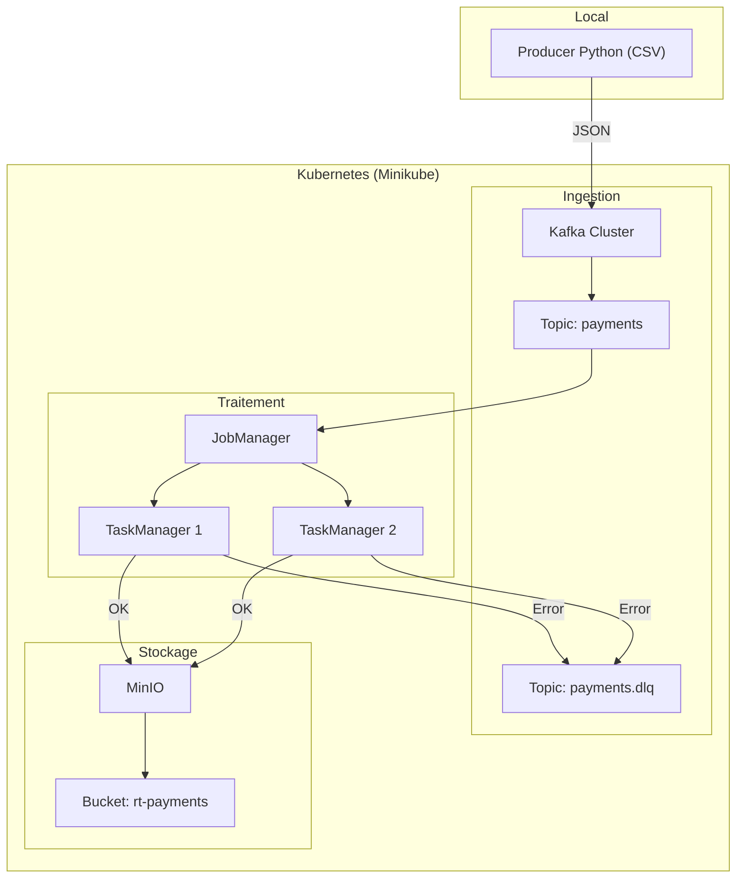
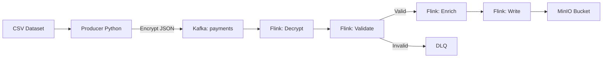

# POC — Pipeline de Paiements en Temps Réel


## Table des matières

1. [Vue d'ensemble](#vue-densemble)
2. [Architecture](#architecture)
3. [Prérequis](#prérequis)
4. [Structure du projet](#structure-du-projet)
5. [Démarrage rapide](#démarrage-rapide)
6. [Détail des composants](#détail-des-composants)
7. [Utilisation du pipeline](#utilisation-du-pipeline)
8. [Commandes utiles](#commandes-utiles)
9. [Arrêter l'environnement](#arrêter-lenvironnement)
10. [FAQ & Dépannage](#faq--dépannage)

---

## Vue d'ensemble

Ce POC simule un pipeline de traitement de transactions de paiement en temps réel. Des données CSV (transactions) sont lues par un **producer Python**, publiées sur **Kafka**, traitées par **Apache Flink** (déchiffrement, validation, enrichissement), puis stockées dans **MinIO** (stockage objet compatible S3).

Toute l'infrastructure est provisionnée automatiquement via un seul script Bash qui génère et applique de la configuration **Terraform** + des manifests **Kubernetes**.

---

## Architecture



---

## 🔄 Flux de données



---

## Prérequis

### Outils à installer

| Outil | Version minimale | Installation |
|-------|-----------------|--------------|
| minikube | >= 1.32 | https://minikube.sigs.k8s.io/docs/start/ |
| kubectl | >= 1.28 | https://kubernetes.io/docs/tasks/tools/ |
| helm | >= 3.13 | https://helm.sh/docs/intro/install/ |
| terraform | >= 1.7 | https://developer.hashicorp.com/terraform/install |
| jq | any | `apt install jq` / `brew install jq` |
| curl | any | préinstallé sur la plupart des systèmes |
| Docker | any | https://docs.docker.com/get-docker/ |

### Ressources machine recommandées

| Ressource | Minimum | Recommandé |
|-----------|---------|------------|
| CPU | 4 cœurs | 4+ cœurs |
| RAM | 6 Go | 8 Go |
| Disque | 20 Go | 30 Go |

### Système d'exploitation

- **Linux / WSL2 (Ubuntu 22.04+)** : pris en charge nativement
- **macOS** : pris en charge avec le driver Docker ou HyperKit
- **Windows** : utiliser **WSL2** ou **Git Bash** (PowerShell non supporté)

---

## Structure du projet

```
POC_Streaming/
│
├── setup_poc.sh              # Script principal — génère et déploie tout
│
├── terraform/                # Généré automatiquement par setup_poc.sh
│   ├── main.tf               # Providers Terraform (kubernetes, helm)
│   ├── variables.tf          # Variables (versions, noms, credentials)
│   ├── namespaces.tf         # Création des 3 namespaces K8s
│   ├── kafka.tf              # Strimzi operator + Kafka cluster + Topics
│   ├── flink.tf              # Flink operator + FlinkDeployment + ConfigMap
│   ├── minio.tf              # MinIO Helm release + Secret
│   └── outputs.tf            # Outputs : URLs et endpoints
│
├── k8s/                      # Généré automatiquement par setup_poc.sh
│   ├── flink-rbac.yaml       # ServiceAccount flink + ClusterRoleBinding
│   └── network-policies.yaml # NetworkPolicies inter-namespaces
│
└── scripts/
    └── producer.py           # Généré automatiquement — lit CSV et publie sur Kafka
```

---

## Démarrage rapide

### Étape 1 — Cloner le repo et lancer le script

```bash
git clone <url-du-repo>
cd POC_Streaming

chmod +x setup_poc.sh
./setup_poc.sh up
```

Le script exécute automatiquement dans l'ordre :
1. Vérification des prérequis
2. Démarrage de Minikube
3. Génération des fichiers Terraform et manifests K8s
4. Installation des operators Helm (Strimzi, Flink, MinIO)
5. Déploiement du cluster Kafka, du cluster Flink et du bucket MinIO
6. Application des RBAC et NetworkPolicies
7. Attente de la disponibilité de tous les composants

> **Note :** Le script effectue deux passes Terraform car les CRDs Kubernetes (Kafka, FlinkDeployment) doivent être installées par les operators avant de pouvoir créer les ressources qui les utilisent.

### Étape 2 — Vérifier que tout est Running

```bash
./setup_poc.sh status
```

Résultat attendu :

```
=== ingestion (Kafka / Strimzi) ===
NAME                                  READY   STATUS    AGE
strimzi-cluster-operator-xxx          1/1     Running   5m
payments-cluster-kafka-0              1/1     Running   3m

=== traitement (Apache Flink) ===
NAME                                  READY   STATUS    AGE
flink-kubernetes-operator-xxx         1/1     Running   5m
poc-pipeline-xxx (JobManager)         1/1     Running   3m
poc-pipeline-taskmanager-xxx          1/1     Running   3m
poc-pipeline-taskmanager-xxx          1/1     Running   3m

=== stockage (MinIO) ===
NAME                   READY   STATUS    AGE
minio-xxx              1/1     Running   5m
```

---

## Détail des composants

### 1. Namespace `ingestion` — Apache Kafka (Strimzi)

Kafka est le bus de messages central. Il reçoit les transactions du producer et les met à disposition de Flink.

| Paramètre | Valeur |
|-----------|--------|
| Operator | Strimzi 0.40.0 |
| Kafka version | 3.7.0 |
| Nombre de brokers | 1 (POC) |
| Topic `payments` | 3 partitions, rétention 7 jours, compression lz4 |
| Topic `payments.dlq` | 1 partition, rétention 30 jours (erreurs) |
| Accès interne (Flink) | `payments-cluster-kafka-bootstrap.ingestion.svc:9092` |
| Accès externe (Producer) | `<minikube-ip>:<nodeport>` via `:9094` |
| Stockage | Éphémère (données perdues si pod redémarré) |

**Pourquoi Strimzi ?** Strimzi est un opérateur Kubernetes qui gère le cycle de vie complet de Kafka : création du cluster, des topics, des utilisateurs, et des certificats TLS, le tout déclarativement via des ressources Kubernetes.

---

### 2. Namespace `traitement` — Apache Flink

Flink consomme les messages Kafka et les traite en streaming.

| Paramètre | Valeur |
|-----------|--------|
| Operator | flink-kubernetes-operator 1.8.0 |
| Image Flink | `flink:1.18-scala_2.12` |
| Mode | Session cluster (les jobs sont soumis séparément) |
| JobManager | 1 replica, 1024 MB RAM, 0.5 CPU |
| TaskManagers | 2 replicas, 1024 MB RAM, 1 CPU chacun |
| Slots par TaskManager | 4 (= 8 slots au total, supporte 4 jobs parallèles) |
| State backend | RocksDB (persistance locale des états) |
| Checkpointing | Toutes les 60 secondes, mode EXACTLY_ONCE |
| REST API | `http://localhost:8081` (via port-forward) |

**Les 4 jobs Flink à déployer :**

| Job | Rôle |
|-----|------|
| Decrypt | Déchiffre le payload base64 de chaque message |
| Validate | Valide les champs requis — envoie les invalides en DLQ |
| Enrich | Ajoute des métadonnées : niveau de risque, timestamp lisible |
| Write | Écrit les transactions enrichies dans MinIO en JSON |

**Pourquoi Flink ?** Flink garantit un traitement exactement-une-fois (EXACTLY_ONCE), gère l'état distribué, et peut traiter des millions d'événements par seconde avec une latence de quelques millisecondes.

---

### 3. Namespace `stockage` — MinIO

MinIO est le stockage final des données traitées. Il expose une API compatible S3.

| Paramètre | Valeur |
|-----------|--------|
| Mode | Standalone (POC) |
| Bucket | `rt-payments` |
| API S3 | `http://minio.stockage.svc:9000` (interne) |
| Console web | `http://localhost:9001` (via port-forward) |
| Login | `minioadmin` |
| Mot de passe | `minioadmin` |
| Persistance | Éphémère (POC) |

---

### 4. NetworkPolicies

Deux politiques réseau contrôlent les communications entre namespaces :

| Règle | Source | Destination | Port |
|-------|--------|-------------|------|
| allow-traitement-to-ingestion | namespace `traitement` | pods Kafka | 9092 |
| allow-traitement-to-stockage | namespace `traitement` | pods MinIO | 9000 |

Sans ces règles, Flink ne pourrait pas communiquer avec Kafka ni avec MinIO.

---

## Utilisation du pipeline

### Étape 1 — Exposer les interfaces

Ouvrir deux terminaux :

```bash
# Terminal 1 — Flink UI
kubectl port-forward svc/poc-pipeline-rest 8081:8081 -n traitement

# Terminal 2 — MinIO Console
kubectl port-forward svc/minio-console 9001:9001 -n stockage
```

- **Flink UI** : http://localhost:8081
- **MinIO Console** : http://localhost:9001 (`minioadmin` / `minioadmin`)

### Étape 2 — Soumettre les jobs Flink

Les jobs doivent être compilés (Maven/Gradle) puis soumis via l'API REST Flink.

```bash
# Compiler les jobs (depuis le dossier du projet Java)
mvn clean package -DskipTests

# Uploader un JAR
curl -X POST http://localhost:8081/jars/upload \
  -H "Expect:" \
  -F "jarfile=@target/mon-job.jar"

# Récupérer le jar-id depuis la réponse, puis démarrer le job
curl -X POST http://localhost:8081/jars/<jar-id>/run \
  -H "Content-Type: application/json" \
  -d '{
    "programArgsList": [
      "--kafka.bootstrap", "payments-cluster-kafka-bootstrap.ingestion.svc:9092",
      "--minio.endpoint", "http://minio.stockage.svc:9000",
      "--minio.bucket", "rt-payments"
    ]
  }'
```

### Étape 3 — Lancer le producer Python

```bash
# Installer les dépendances
pip install kafka-python pandas cryptography

# Trouver l'IP et le port Kafka externe
MINIKUBE_IP=$(minikube ip)
KAFKA_PORT=$(kubectl get svc payments-cluster-kafka-external-bootstrap \
  -n ingestion -o jsonpath='{.spec.ports[0].nodePort}')

# Lancer le producer (exemple avec 100 messages à 10 msg/s)
python3 scripts/producer.py \
  --csv creditcard.csv \
  --bootstrap ${MINIKUBE_IP}:${KAFKA_PORT} \
  --rate 10 \
  --limit 100
```

**Dataset recommandé :** [Credit Card Fraud Detection](https://www.kaggle.com/datasets/mlg-ulb/creditcardfraud) (284 807 transactions, ~150 MB)

### Étape 4 — Valider le flux bout-en-bout

```bash
# Vérifier les messages dans Kafka
kubectl exec -n ingestion \
  $(kubectl get pod -n ingestion -l strimzi.io/name=payments-cluster-kafka \
    -o jsonpath='{.items[0].metadata.name}') \
  -- bin/kafka-console-consumer.sh \
  --bootstrap-server localhost:9092 \
  --topic payments \
  --from-beginning \
  --max-messages 5

# Vérifier les fichiers dans MinIO (depuis la console web ou mc CLI)
# → http://localhost:9001 → bucket rt-payments
```

---

## Commandes utiles

```bash
# État général de tous les pods
./setup_poc.sh status

# Afficher le plan Terraform sans appliquer
./setup_poc.sh plan

# Lister les topics Kafka
kubectl exec -n ingestion \
  $(kubectl get pod -n ingestion -l strimzi.io/name=payments-cluster-kafka \
    -o jsonpath='{.items[0].metadata.name}') \
  -- bin/kafka-topics.sh --bootstrap-server localhost:9092 --list

# Voir les logs du Flink JobManager
kubectl logs -n traitement \
  $(kubectl get pod -n traitement -l component=jobmanager \
    -o jsonpath='{.items[0].metadata.name}')

# Voir les logs du producer / d'un TaskManager
kubectl logs -n traitement \
  $(kubectl get pod -n traitement -l component=taskmanager \
    -o jsonpath='{.items[0].metadata.name}')

# Voir les outputs Terraform (endpoints)
cd terraform && terraform output
```

---

## Arrêter l'environnement

```bash
# Détruire toute l'infrastructure (demande confirmation)
./setup_poc.sh down

# Ou manuellement
cd terraform && terraform destroy -auto-approve
minikube stop
```

---

## FAQ & Dépannage

### Les pods Flink restent en `ContainerCreating` longtemps

L'image `flink:1.18-scala_2.12` est volumineuse (~500 MB). Pour accélérer le pull :

```bash
minikube image pull flink:1.18-scala_2.12
```

### Erreur `CRD may not be installed` avec Terraform

Les CRDs Strimzi et Flink doivent être installées avant de créer les ressources Kafka et FlinkDeployment. Appliquer en deux passes :

```bash
# Passe 1 : operators uniquement
terraform apply -auto-approve \
  -target=helm_release.strimzi_operator \
  -target=helm_release.flink_operator

# Attendre les CRDs
kubectl wait --for=condition=Established crd/kafkas.kafka.strimzi.io --timeout=120s
kubectl wait --for=condition=Established crd/flinkdeployments.flink.apache.org --timeout=120s

# Passe 2 : tout le reste
terraform apply -auto-approve
```

### Erreur `rolebindings already exists` avec Strimzi

```bash
helm uninstall strimzi-kafka-operator -n ingestion --ignore-not-found
kubectl delete rolebinding \
  strimzi-cluster-operator-watched \
  strimzi-cluster-operator \
  strimzi-cluster-operator-entity-operator-delegation \
  -n ingestion --ignore-not-found
```

### L'URL du repo Helm Flink retourne 404

Le repo `downloads.apache.org` est parfois indisponible. Utiliser l'archive :

```bash
sed -i 's|https://downloads.apache.org/flink/flink-kubernetes-operator-\${var.flink_operator_version}/|https://archive.apache.org/dist/flink/flink-kubernetes-operator-1.8.0/|' terraform/flink.tf
```

### Le producer Python ne trouve pas Kafka

```bash
# Vérifier l'IP et le port
minikube ip
kubectl get svc payments-cluster-kafka-external-bootstrap -n ingestion
```

---

## Variables d'environnement

Le comportement du script peut être personnalisé avant de le lancer :

```bash
export MINIKUBE_CPUS=4
export MINIKUBE_MEMORY=8192      # en MB
export MINIKUBE_DISK=30g
export MINIKUBE_DRIVER=docker    # docker | virtualbox | hyperkit
```

---

*POC réalisé avec Minikube · Strimzi · Apache Flink · MinIO · Terraform*
