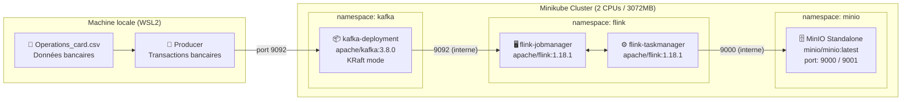
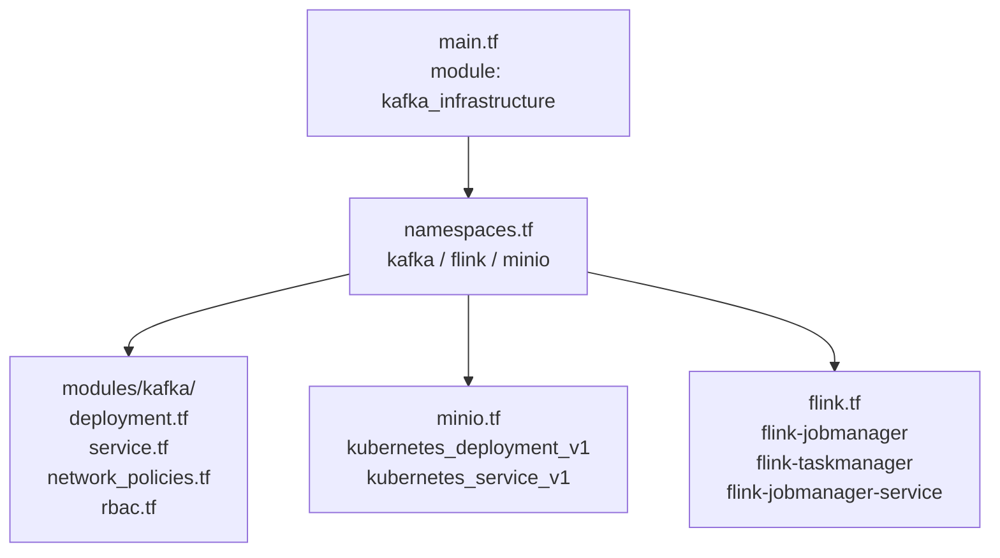
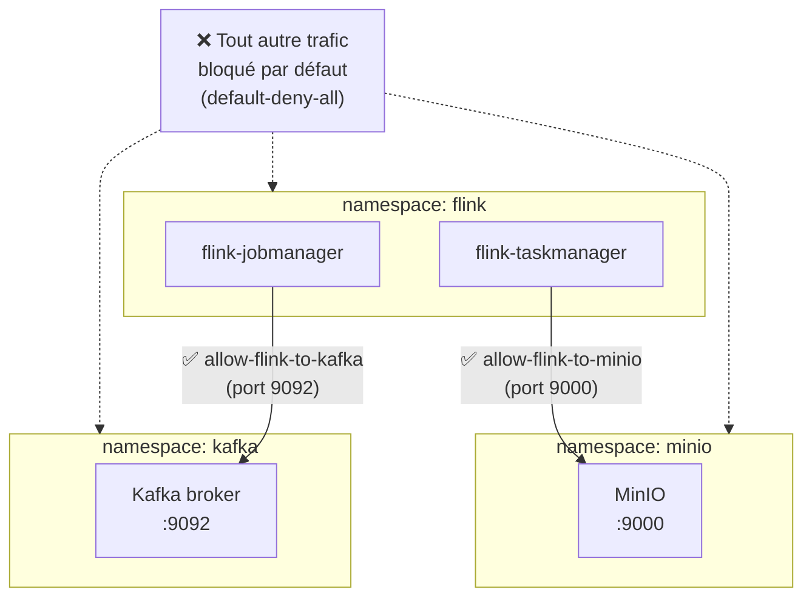

# DGS-Streaming — Infrastructure Temps Réel des Données Bancaires

> **Proof of Concept** — Pipeline de traitement en temps réel des transactions bancaires,
> déployé sur Minikube avec Terraform 

---

## Table des matières

1. [Vue d'ensemble](#1-vue-densemble)
2. [Architecture](#2-architecture)
3. [Prérequis](#3-prérequis)
4. [Structure du projet](#4-structure-du-projet)
5. [Composants déployés](#5-composants-déployés)
6. [Déploiement](#6-déploiement)
7. [Vérification de l'état du cluster](#7-vérification-de-létat-du-cluster)
8. [Sécurité réseau et RBAC](#8-sécurité-réseau-et-rbac)
9. [Dépannage — Problèmes rencontrés](#9-dépannage--problèmes-rencontrés)
10. [Suppression de l'infrastructure](#10-suppression-de-linfrastructure)

---

## 1. Vue d'ensemble

Ce PoC démontre un pipeline de streaming temps réel pour le traitement des transactions bancaires. Les données de transactions (fichier CSV `Operations_card`) sont ingérées via **Apache Kafka**, traitées par **Apache Flink**, et stockées dans **MinIO**. L'infrastructure complète est provisionnée via **Terraform** sur un cluster Kubernetes local **Minikube**, en mode KRaft (sans Zookeeper).

```
Données CSV Bancaires
        │
        ▼
Producer ──► Apache Kafka ──► Apache Flink ──► MinIO (S3)
             (KRaft mode)    (JM + TM)        (stockage objet)
```

**Stack technique :**

| Composant | Technologie | Version |
|-----------|-------------|---------|
| Orchestration K8s | Minikube | ≥ 1.28 |
| Infrastructure as Code | Terraform | ≥ 1.6 |
| Message broker | Apache Kafka | 3.8.0 |
| Moteur de traitement | Apache Flink | 1.18.1 |
| Stockage objet | MinIO | latest |
| Driver Minikube | Docker | ≥ 24.0 |

---

## 2. Architecture

### Diagramme de flux de données



### Diagramme d'infrastructure Terraform



### Diagramme de sécurité réseau



---

## 3. Prérequis

### Outils requis

| Outil | Version minimale | Installation |
|-------|-----------------|--------------|
| WSL2 | — | Windows Features |
| Minikube | ≥ 1.28 | [minikube.sigs.k8s.io](https://minikube.sigs.k8s.io) |
| Helm | ≥ 3.12 | `snap install helm --classic` |
| Terraform | ≥ 1.6 | `snap install terraform` |
| kubectl | ≥ 1.28 | Via Minikube ou `snap install kubectl` |
| Docker | ≥ 24.0 | Requis comme driver Minikube |

### Démarrage de Minikube

```bash
minikube start --cpus=2 --memory=3072 --driver=docker
```

> **Contraintes de ressources** : Le cluster est dimensionné pour 2 vCPU et 3 072 Mo de RAM.
> Les images sont pré-chargées via `minikube image load` pour éviter les problèmes de pull réseau.

### Alias kubectl recommandés

```bash
alias k='kubectl'
alias kgp='kubectl get pods'
alias kga='kubectl get pods -A'
alias kns='kubectl config set-context --current --namespace'
```

---

## 4. Structure du projet

```
infrastructure-projet/
├── .gitignore                    # Exclut .terraform/, tfstate, tfvars
├── README.md                     # Ce document
├── Operations_card_*.csv         # Données bancaires source
├── main.tf                       # Module kafka_infrastructure
├── namespaces.tf                 # Namespaces : kafka / flink / minio
├── kafka.tf                      # (référence module)
├── minio.tf                      # Déploiement MinIO + Service
├── flink.tf                      # JobManager + TaskManager + Service
├── providers.tf                  # Provider Kubernetes
├── variables.tf                  # Variables Terraform
└── modules/
    └── kafka/
        ├── deployment.tf         # Déploiement apache/kafka:3.8.0
        ├── service.tf            # Service Kafka port 9092
        ├── network_policies.tf   # default-deny + allow-flink-to-kafka
        └── rbac.tf               # Role + RoleBinding Flink
```

---

## 5. Composants déployés

### 5.1 Apache Kafka — namespace `kafka`

| Ressource | Nom | Détail |
|-----------|-----|--------|
| Deployment | `kafka-deployment` | Image `apache/kafka:3.8.0` |
| Service | `kafka-service` | ClusterIP, port 9092 |
| NetworkPolicy | `default-deny-all` | Bloque tout trafic entrant |
| NetworkPolicy | `allow-flink-to-kafka` | Autorise Flink → port 9092 |
| Role | `flink-role` | Permissions Kubernetes pour Flink |
| RoleBinding | `flink-role-binding` | Lie le role au ServiceAccount |

**Configuration KRaft (sans Zookeeper) :**

```
KAFKA_NODE_ID=1
KAFKA_PROCESS_ROLES=broker,controller
KAFKA_LISTENERS=PLAINTEXT://:9092,CONTROLLER://:9093
KAFKA_CONTROLLER_QUORUM_VOTERS=1@localhost:9093
KAFKA_OFFSETS_TOPIC_REPLICATION_FACTOR=1
```

### 5.2 Apache Flink — namespace `flink`

| Ressource | Nom | Détail |
|-----------|-----|--------|
| Deployment | `flink-jobmanager` | 1 réplique, REST UI :8081 |
| Deployment | `flink-taskmanager` | 1 réplique |
| Service | `flink-jobmanager-service` | ClusterIP, ports 6123 (RPC) + 8081 (UI) |

### 5.3 MinIO — namespace `minio`

| Ressource | Nom | Détail |
|-----------|-----|--------|
| Deployment | `minio-deployment` | Image `minio/minio:latest` |
| Service | `minio-service` | ClusterIP, port 9000 (API) + 9001 (Console) |

**Credentials par défaut :**
- User : `minioadmin`
- Password : `minioadmin`

---

## 6. Déploiement

### Étape 1 — Pré-charger les images dans Minikube

> ⚠️ Les images `bitnami/kafka` n'étant plus disponibles sur Docker Hub, on utilise les images officielles Apache et on les charge directement dans Minikube pour éviter tout problème de pull réseau.

```bash
# Télécharger les images depuis WSL
docker pull apache/kafka:3.8.0
docker pull apache/flink:1.18.1
docker pull minio/minio:latest

# Charger dans Minikube (5-10 min par image)
minikube image load apache/kafka:3.8.0
minikube image load apache/flink:1.18.1
minikube image load minio/minio:latest
```

### Étape 2 — Initialiser Terraform

```bash
cd ~/infrastructure-projet
terraform init
```

### Étape 3 — Planifier

```bash
terraform plan
```

### Étape 4 — Appliquer

```bash
terraform apply
```

> ⚠️ Taper exactement `yes` (minuscules) pour confirmer.

### Étape 5 — Vérifier

```bash
kubectl get pods -A
```

Résultat attendu :

```
NAMESPACE   NAME                                 READY   STATUS    RESTARTS
kafka       kafka-deployment-xxxxx               1/1     Running   0
flink       flink-jobmanager-xxxxx               1/1     Running   0
flink       flink-taskmanager-xxxxx              1/1     Running   0
minio       minio-deployment-xxxxx               1/1     Running   0
```

---

## 7. Vérification de l'état du cluster

```bash
# Tous les pods
kubectl get pods -A

# Namespaces
kubectl get namespaces

# Services
kubectl get svc -A

# Network Policies
kubectl get networkpolicy -A

# RBAC
kubectl get role,rolebinding -A
```

---

## 8. Sécurité réseau et RBAC

### NetworkPolicies

| Politique | Namespace | Effet |
|-----------|-----------|-------|
| `default-deny-all` | `kafka`, `flink`, `minio` | Bloque tout trafic entrant par défaut |
| `allow-flink-to-kafka` | `kafka` | Autorise namespace `flink` → port 9092 |

### RBAC Flink

Le `Role` `flink-role` dans le namespace `flink` est lié via `flink-role-binding` pour permettre aux jobs Flink d'interagir avec l'API Kubernetes (lecture des pods, services, configmaps).

---

## 9. Dépannage — Problèmes rencontrés

### 9.1 `bitnami/kafka` introuvable sur Docker Hub

**Symptôme :**
```
manifest for bitnami/kafka:3.7.0 not found: manifest unknown
manifest for bitnami/kafka:3.9 not found: manifest unknown
```

**Cause :** Bitnami a supprimé ses images de Docker Hub public. Les tags `3.x` n'existent plus.

**Solution :** Migrer vers l'image officielle Apache :
```hcl
# Dans modules/kafka/deployment.tf
image = "apache/kafka:3.8.0"
```

Et pré-charger l'image dans Minikube :
```bash
docker pull apache/kafka:3.8.0
minikube image load apache/kafka:3.8.0
```

---

### 9.2 Terraform timeout — `Waiting for rollout to finish`

**Symptôme :**
```
Error: Waiting for rollout to finish: 1 old replicas are pending termination...
```

**Cause :** Minikube avec 2 CPUs / 3072MB est lent pour les rolling updates. Terraform timeout avant que le pod soit `Running`.

**Solution :** Ajouter `timeouts` et `strategy = Recreate` dans le deployment :
```hcl
timeouts {
  create = "15m"
  update = "15m"
  delete = "15m"
}

spec {
  strategy {
    type = "Recreate"
  }
}
```

---

### 9.3 Terraform n'accepte pas `YES` en majuscule

**Symptôme :**
```
Apply cancelled.
```

**Solution :** Toujours taper `yes` (minuscules) pour confirmer.

---

### 9.4 Pods bloqués en `Terminating` après Ctrl+C

**Solution :**
```bash
kubectl delete pod -n kafka --all --force --grace-period=0
```

---

### 9.5 Vieux pods `my-kafka-controller` dans le namespace `default`

**Cause :** Ancienne installation Helm de Kafka laissant un StatefulSet.

**Solution :**
```bash
kubectl delete statefulset my-kafka-controller -n default
kubectl delete pod my-kafka-controller-0 my-kafka-controller-1 my-kafka-controller-2 \
  -n default --force --grace-period=0
```

---

### 9.6 `minio.tf` et `flink.tf` vides — aucun pod déployé

**Cause :** Les fichiers `.tf` étaient créés mais vides (0 bytes). Terraform ne déploie rien sans contenu.

**Solution :** Remplir les fichiers avec les ressources `kubernetes_deployment_v1` et `kubernetes_service_v1`, puis relancer `terraform apply`.

---

### 9.7 Push GitHub rejeté — authentification par mot de passe non supportée

**Symptôme :**
```
remote: Invalid username or token. Password authentication is not supported.
```

**Cause :** GitHub n'accepte plus les mots de passe depuis 2021.

**Solution :** Créer un **Personal Access Token** sur [github.com/settings/tokens/new](https://github.com/settings/tokens/new) avec le scope `repo`, et l'utiliser comme mot de passe lors du push :
```bash
git push -u origin main:oussama
# Username: 0ussama04
# Password: ghp_xxxxxxxxxxxx  ← Personal Access Token
```

---

## 10. Suppression de l'infrastructure

```bash
# Supprimer toute l'infrastructure Terraform
cd ~/infrastructure-projet
terraform destroy -auto-approve

# Supprimer les pods résiduels
kubectl delete pod --all -n kafka --force --grace-period=0
kubectl delete pod --all -n flink --force --grace-period=0
kubectl delete pod --all -n minio --force --grace-period=0

# Optionnel : arrêter Minikube
minikube stop
```

---

*DGS-Streaming — Infrastructure v1.0 | Branche : `oussama` | SWAM*
